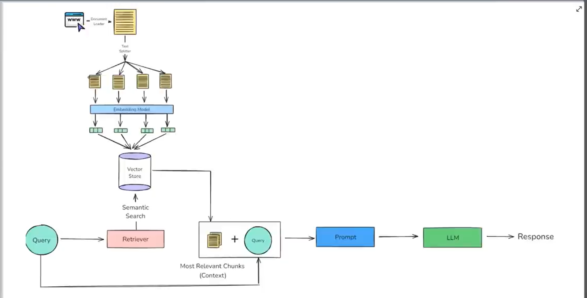
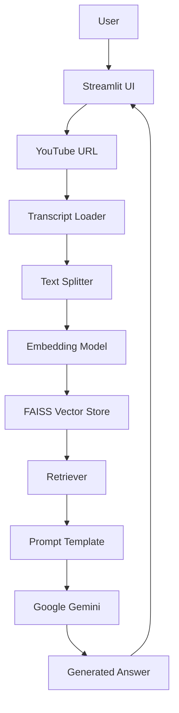
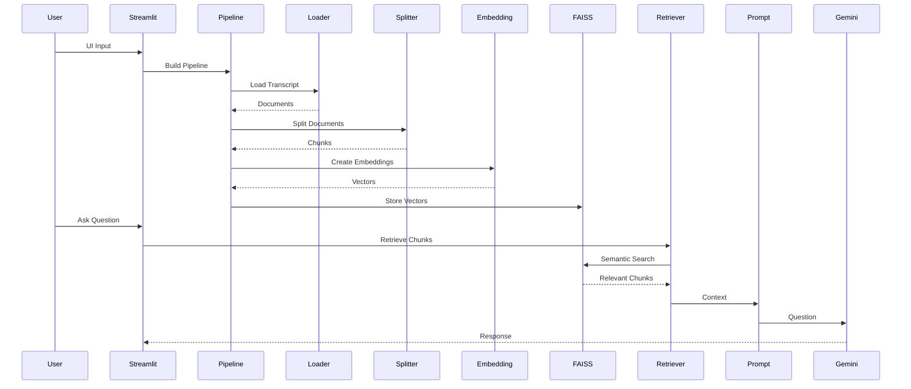
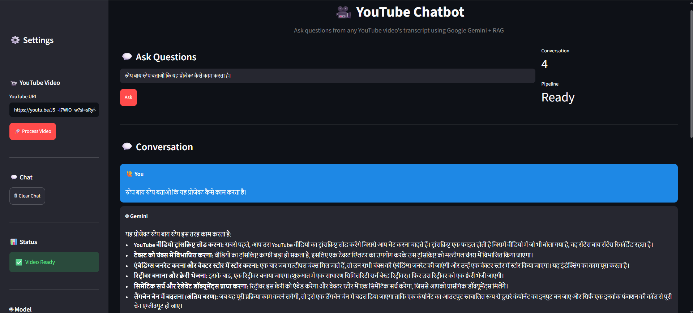

# YouTube ChatBot

Chat with any YouTube video using RAG, Google Gemini, LangChain, and FAISS.
<<<<<<< HEAD
# 🎥 YouTube Chatbot using RAG (Retrieval-Augmented Generation)

<p align="center">


</p>


---

# 📌 Project Overview

YouTube Chatbot is a **Retrieval-Augmented Generation (RAG)** application that allows users to chat with any YouTube video using its transcript.

Simply paste a YouTube video URL, and the application:

- Downloads the transcript
- Splits it into semantic chunks
- Generates embeddings using Google's embedding model
- Stores embeddings in FAISS
- Retrieves the most relevant chunks
- Uses Google Gemini to generate accurate answers

The application supports **English**, **Hindi**, and multilingual videos.

---

# 🚀 Features

- YouTube Transcript Extraction
- Google Gemini LLM
- Google Embedding Model
- FAISS Vector Database
- LangChain LCEL
- Streamlit UI
- Chat History
- Modern Responsive Design
- Logging
- Exception Handling
- Object-Oriented Design
- SOLID Principles
- Hugging Face Deployment Ready

---

# 🏗️ RAG Architecture

<p align="center">



</p>

---

# 🔄 Complete Workflow

```text
YouTube URL
      │
      ▼
Transcript Loader
      │
      ▼
Text Cleaning
      │
      ▼
Text Splitter
      │
      ▼
Embedding Model
      │
      ▼
FAISS Vector Store
      │
      ▼
Retriever
      │
      ▼
Prompt Template
      │
      ▼
Google Gemini
      │
      ▼
Final Response
```

---

# 📊 System Architecture



---

# 🔁 Sequence Diagram



---

# 📂 Project Structure

```text
YouTube-ChatBot/
├── .gitignore
├── .streamlit/
│   └── config.toml
├── LICENSE
├── README.md
├── app.py
├── assets/
│   ├── RAG_Architecture.png
│   └── app_demo.png
├── Dockerfile
│
├──.dockerignore
├── frontend/
│   ├── __init__.py
│   └── streamlit_app.py
├── requirements.txt
├── setup.py
├── src/
│   ├── __init__.py
│   ├── chains/
│   │   ├── __init__.py
│   │   └── rag_chain.py
│   ├── config.py
│   ├── constants.py
│   ├── embeddings/
│   │   ├── __init__.py
│   │   └── embedding_model.py
│   ├── exception.py
│   ├── llm/
│   │   ├── __init__.py
│   │   └── gemini_model.py
│   ├── loaders/
│   │   ├── __init__.py
│   │   └── youtube_loader.py
│   ├── logger.py
│   ├── pipeline/
│   │   ├── __init__.py
│   │   └── rag_pipeline.py
│   ├── preprocess/
│   │   ├── __init__.py
│   │   └── splitter.py
│   ├── prompts/
│   │   ├── __init__.py
│   │   └── prompt_template.py
│   ├── retriever/
│   │   ├── __init__.py
│   │   └── retriever.py
│   ├── utils/
│   │   ├── __init__.py
│   │   ├── text.py
│   │   ├── validators.py
│   │   └── youtube.py
│   └── vectorstore/
│       ├── __init__.py
│       └── faiss_store.py
├── test.py
└── vector_store/
    ├── index.faiss
    └── index.pkl
```


---

# ⚙️ Tech Stack

| Technology | Description |
|------------|-------------|
| Python | Programming Language |
| Streamlit | Web Application |
| LangChain | RAG Framework |
| Google Gemini | Large Language Model |
| Google Embeddings | Embedding Model |
| FAISS | Vector Database |
| YouTube Transcript API | Transcript Extraction |

---

# 📦 Installation

Clone the repository

```bash
git clone https://github.com/YOUR_USERNAME/YouTube-Chatbot.git

cd YouTube-Chatbot
```

Create Virtual Environment

```bash
python -m venv venv
```

Activate Environment

Windows

```bash
venv\Scripts\activate
```

Linux / Mac

```bash
source venv/bin/activate
```

Install Dependencies

```bash
pip install -r requirements.txt
```

---

# 🔑 Environment Variables

Create a `.env` file in the project root:

```env
GOOGLE_API_KEY=YOUR_GOOGLE_API_KEY

GEMINI_MODEL=gemini-2.5-flash

EMBEDDING_MODEL=models/gemini-embedding-001

CHUNK_SIZE=1000

CHUNK_OVERLAP=200

RETRIEVER_TOP_K=4
```

> **Note:** `models/text-embedding-004` has been deprecated by Google and will return a `404 NOT_FOUND` error. Use `models/gemini-embedding-001` instead.

---

# ▶️ Run Locally

```bash
streamlit run app.py
```

---

# 🤗 Deploy on Hugging Face

1. Create a new **Streamlit Space**.
2. Upload the project files.
3. Add your `GOOGLE_API_KEY` as a **Space Secret**.
4. Ensure `app.py` is the entry point.
5. The app will build automatically.

---

# 🧪 Future Improvements

- Chat Memory
- Multiple Video Support
- PDF Export
- Citation Sources
- Hybrid Search
- Reranking
- Conversation History Persistence
- Docker Support
- REST API (FastAPI)
- Authentication
- Multi-LLM Support

---

# 📸 Application Screenshot

<p align="center">



</p>

---

# 👨‍💻 Author

**Shravan Kumar Pandey**

B.Tech (CSE - Data Science)

GitHub: https://github.com/Shravan4598

LinkedIn: https://linkedin.com/in/shravan-kumar-pandey-309786309

---

# ⭐ If you found this project useful, please consider giving it a star on GitHub.
=======
---
title: YouTube ChatBot
emoji: 🦀
colorFrom: yellow
colorTo: yellow
sdk: static
pinned: false
license: apache-2.0
short_description: Chat with any YouTube video using RAG.
---

Check out the configuration reference at https://huggingface.co/docs/hub/spaces-config-reference
>>>>>>> 2ad195f099fb83630d151d48b52e421fc1c1e8bc
